  

  I run infrastructure end to end. Sole DevOps engineer at Geeks of Kolachi: pipelines, deploys, AWS, security, on-call. 
  Before that I shipped 30+ client apps across seven cloud providers at The Botss. I like automating the parts people still do by hand.

  

  

